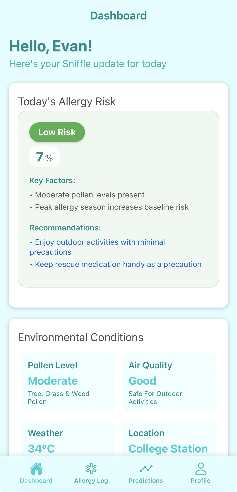

# Sniffle

Breathe better. Live clearer.

Sniffle is an intelligent allergy companion that helps you stay one step ahead of the air around you.





## Quickstart

### Frontend (Expo)
1. Install deps:
   - Node.js LTS
   - Android Studio (SDK + emulator)
2. Install packages:
   ```bash
   npm install
   ```
3. Create a `.env` by copying `.env.example` and filling values.
4. Start Metro and launch on Android emulator:
   ```bash
   npm run android
   ```

If you need to open in Android Studio: run `npx expo prebuild -p android` once, then open the `android/` folder in Android Studio and run.

### Backend (Node.js)
1. Navigate to backend directory:
   ```bash
   cd backend
   ```
2. Install deps:
   ```bash
   npm install
   ```
3. Set up environment:
   - Copy `.env.example` to `.env` in the backend directory
   - Add your API keys (OpenWeatherMap, etc.)
   - Place your `firebase_credentials.json` in the backend directory
4. Run API:
   ```bash
   npm start
   ```
   Or for development with auto-reload:
   ```bash
   npm run dev
   ```

Default API base (Android emulator): `http://10.0.2.2:5000`

## Environment
Create `.env` in project root (used by `react-native-dotenv`):
```
API_URL=http://10.0.2.2:5000
FIREBASE_API_KEY=...
FIREBASE_AUTH_DOMAIN=...
FIREBASE_PROJECT_ID=...
FIREBASE_STORAGE_BUCKET=...
FIREBASE_MESSAGING_SENDER_ID=...
FIREBASE_APP_ID=...
FIREBASE_MEASUREMENT_ID=...
```

More coming soon.
